# C01 · 项目全景与四种入口形态

## 源码锚点

- 源码版本：`290fdc9481a70612bc5823aa4ed225c52c52aad3`（仓库根：`~/work/code/awesome-project/claude-code-cli`）
- 主入口：
  - `entrypoints/cli.tsx:1-302`（CLI Bootstrap，302 行）
  - `entrypoints/init.ts:1-340`（共享初始化骨架，340 行）
  - `entrypoints/agentSdkTypes.ts:1-443`（Agent SDK 公开类型门面，443 行）
  - `entrypoints/sdk/coreTypes.ts:1-62`、`entrypoints/sdk/coreSchemas.ts:1-1889`、`entrypoints/sdk/controlSchemas.ts:1-663`
  - `entrypoints/mcp.ts:1-196`（MCP server 入口，196 行）
  - `entrypoints/sandboxTypes.ts:1-156`（Sandbox 配置类型源，156 行）
- 关键类型：`SandboxSettings`、`SandboxNetworkConfig`、`SandboxFilesystemConfig`、`HOOK_EVENTS`、`EXIT_REASONS`、`SDKControlRequest`、`SDKControlResponse`、`McpSdkServerConfigWithInstance`、`SDKMessage`、`RemoteControlHandle`、`CronTask`
- 关键函数：
  - `main()`（`entrypoints/cli.tsx:33-299`）
  - `init()`（`entrypoints/init.ts:57-238`，由 lodash `memoize` 包装）
  - `initializeTelemetryAfterTrust()`（`entrypoints/init.ts:247-286`）
  - `startMCPServer(cwd, debug, verbose)`（`entrypoints/mcp.ts:35-196`）
  - `tool()`、`createSdkMcpServer()`、`query()`、`unstable_v2_createSession()`、`unstable_v2_resumeSession()`、`unstable_v2_prompt()`（`entrypoints/agentSdkTypes.ts:73-165`）
  - `getSessionMessages()`、`listSessions()`、`getSessionInfo()`、`renameSession()`、`tagSession()`、`forkSession()`（`entrypoints/agentSdkTypes.ts:178-273`）
  - `watchScheduledTasks()`、`buildMissedTaskNotification()`、`connectRemoteControl()`（`entrypoints/agentSdkTypes.ts:350-443`）
- 数字来源：`ls ~/work/code/awesome-project/claude-code-cli/<dir>` 与 `wc -l <file>`，命令在 commit `290fdc9` 上执行；本章不引用任何附录脚本生成的 manifest（C01 早于附录脚本基础设施合并）。

> 说明：`entrypoints/sdk/coreSchemas.ts` 与 `entrypoints/sdk/controlSchemas.ts` 是 Zod schema 定义，并非"运行时入口"；它们之所以列入主入口锚点，是因为 `coreTypes.ts:1-9`、`agentSdkTypes.ts:12-31` 注释明确指出 SDK 的所有公共类型由这两份 schema 经 `bun scripts/generate-sdk-types.ts` 生成（`entrypoints/sdk/coreTypes.ts:1-9`）。

---

## 1. 为什么从"四种入口形态"重画全景

v1 第 1 篇（`docs/01-项目全景.md` v1 版本）以"`cli.tsx → main.tsx → REPL`"为主线绘制了启动链路与模块树。这条线在 commit `290fdc9` 上仍然成立——但它只是 Claude Code 的**一种**入口。当读者打开 `entrypoints/` 目录会看到（`ls entrypoints/` 在 `290fdc9`）：

```
entrypoints/
├── cli.tsx
├── init.ts
├── mcp.ts
├── sandboxTypes.ts
├── agentSdkTypes.ts
└── sdk/
    ├── controlSchemas.ts
    ├── coreSchemas.ts
    └── coreTypes.ts
```

这套目录布局对应了**四种独立的对外形态**：

1. **CLI**：通过 `cli.tsx` Bootstrap，加载 `main.tsx` 进入 REPL 或 print 模式。
2. **Agent SDK**：通过 `agentSdkTypes.ts` 暴露的 `query()` / `unstable_v2_createSession()` / `tool()` / `createSdkMcpServer()` 等函数被 npm 包消费者调用（`entrypoints/agentSdkTypes.ts:73-165`）。
3. **MCP server**：通过 `mcp.ts` 的 `startMCPServer()` 把 Claude Code 自己的工具集暴露成 MCP 协议端点（`entrypoints/mcp.ts:35-196`）。
4. **Sandbox runner**：通过 `sandboxTypes.ts` 的 Zod schema 配置进程级沙箱（文件系统/网络/Unix socket 隔离），被设置系统与 BashTool/PowerShellTool 引用（`entrypoints/sandboxTypes.ts:91-144`）。

四种形态共享同一份源码、同一份 `tools/`、同一份 `commands/`、同一份 `services/`；它们的差异在于**进入路径与运行时上下文的裁剪程度**。本章的目标就是把这种"一棵树、四个入口"的关系一次性讲清。

v1 全景图缺失的另一类是**新出现的一级目录**。我们在 `290fdc9` 上对 `claude-code-cli` 仓库根做了 `ls -d */` 反查，发现至少有 12 个一级模块在 v1 中未单独入图：`bridge/`、`remote/`、`coordinator/`、`buddy/`、`upstreamproxy/`、`server/`、`migrations/`、`native-ts/`、`screens/`、`outputStyles/`、`memdir/`、`assistant/`（详见 §6）。这些目录承载了 v2 整本书新增的 8 章中的 5 章主入口（C04 / C17 / C24 / C25 / C28 / C29 / C30）。

---

## 2. 四种入口形态各自的契约

### 2.1 CLI 入口：`cli.tsx` 是 Bootstrap，不是主程序

`entrypoints/cli.tsx` 共 302 行（`wc -l` @ `290fdc9`）。它不是 CLI 应用本身，而是一个**前置分发器**：在加载 `main.tsx` 之前，先用 `process.argv` 字面匹配检查 12 个特殊路径，命中即直接 `await import()` 对应模块并返回。文件顶部注释把这层定位写得很明确：

> "Bootstrap entrypoint - checks for special flags before loading the full CLI. All imports are dynamic to minimize module evaluation for fast paths. Fast-path for --version has zero imports beyond this file."（`entrypoints/cli.tsx:28-32`）

cli.tsx 的核心 `main()` 定义在 `entrypoints/cli.tsx:33-299`，函数体按顺序检查以下分支（每条都有对应的 `feature()` 编译期 gate 或字面匹配；分支顺序即源码顺序）：

| # | 触发条件 | 入口模块 | 源码行号 |
|---|---|---|---|
| 1 | `args` 长度为 1 且为 `--version` / `-v` / `-V` | 直接 `console.log` `MACRO.VERSION`（无 import） | `cli.tsx:37-42` |
| 2 | `feature('DUMP_SYSTEM_PROMPT')` 且 `args[0] === '--dump-system-prompt'` | `utils/config.js` + `utils/model/model.js` + `constants/prompts.js` | `cli.tsx:53-71` |
| 3 | `process.argv[2] === '--claude-in-chrome-mcp'` | `utils/claudeInChrome/mcpServer.js` | `cli.tsx:72-78` |
| 4 | `process.argv[2] === '--chrome-native-host'` | `utils/claudeInChrome/chromeNativeHost.js` | `cli.tsx:79-85` |
| 5 | `feature('CHICAGO_MCP')` 且 `process.argv[2] === '--computer-use-mcp'` | `utils/computerUse/mcpServer.js` | `cli.tsx:86-93` |
| 6 | `feature('DAEMON')` 且 `args[0] === '--daemon-worker'` | `daemon/workerRegistry.js` | `cli.tsx:100-106` |
| 7 | `feature('BRIDGE_MODE')` 且 `args[0] ∈ {remote-control, rc, remote, sync, bridge}` | `bridge/bridgeMain.js`（含 OAuth + GrowthBook + policyLimits 三道前置） | `cli.tsx:112-162` |
| 8 | `feature('DAEMON')` 且 `args[0] === 'daemon'` | `daemon/main.js` | `cli.tsx:165-180` |
| 9 | `feature('BG_SESSIONS')` 且 `args[0] ∈ {ps, logs, attach, kill}` 或 `args` 含 `--bg`/`--background` | `cli/bg.js` | `cli.tsx:185-209` |
| 10 | `feature('TEMPLATES')` 且 `args[0] ∈ {new, list, reply}` | `cli/handlers/templateJobs.js` | `cli.tsx:212-222` |
| 11 | `feature('BYOC_ENVIRONMENT_RUNNER')` 且 `args[0] === 'environment-runner'` | `environment-runner/main.js` | `cli.tsx:226-233` |
| 12 | `feature('SELF_HOSTED_RUNNER')` 且 `args[0] === 'self-hosted-runner'` | `self-hosted-runner/main.js` | `cli.tsx:238-245` |
| 13 | `--worktree` 配合 `--tmux` / `--tmux=classic` | `utils/worktree.js`（`execIntoTmuxWorktree` 可"伪退出"为 tmux 进程） | `cli.tsx:247-274` |
| 14 | 以上均不命中 | `await import('../main.js')` 进入完整 CLI | `cli.tsx:287-298` |

这张表给出几个 v1 没有点出的事实：

1. **bridge / daemon / BG / templates / environment-runner / self-hosted-runner / worktree-tmux / chrome 系列** 全部走"不进 main.tsx"的旁路；REPL 主路径只是这 13+ 路当中的一条（第 14 条）。换言之，`main.tsx` 的 4683 行编排器逻辑并不覆盖 Claude Code 的所有 CLI 调用 —— 它只覆盖**未命中任何快速路径**的路径。
2. **`feature()` 与字面匹配的混用**是有意为之。`feature()` 由 Bun 的 `bun:bundle` 在编译期内联（`entrypoints/cli.tsx:1`），未启用的 feature 整个分支会被 DCE 删除；字面匹配（如 `--claude-in-chrome-mcp`）则保证外部构建里也存在。bridge 路径同时使用 `feature('BRIDGE_MODE')` 与运行时 `getBridgeDisabledReason()` GrowthBook 校验（`entrypoints/cli.tsx:142`），层次是：编译期门 → OAuth 检查 → GrowthBook gate → policyLimits gate → 进入 `bridgeMain`。这条 4 段式 gate 链路是 v2 首次正式入图的元素。
3. **顶层副作用**写在 `cli.tsx:1-26`：`COREPACK_ENABLE_AUTO_PIN=0`（修复 corepack 的 yarnpkg 自动注入）、`CLAUDE_CODE_REMOTE` 环境下加 `--max-old-space-size=8192`（CCR 容器 16GB）、以及 `feature('ABLATION_BASELINE')` 的 ablation 环境变量回填。注释明确说明 ablation 块"必须**在** init.ts **之前**执行，因为 `BashTool/AgentTool/PowerShellTool` 在 import 时把 `DISABLE_BACKGROUND_TASKS` 捕获到模块级常量"（`entrypoints/cli.tsx:16-19`）。这是一个 v2 才点名的硬约束：**模块级 const 捕获时间 < init() 调用时间**，所以与之相关的 env 必须在 cli.tsx 顶层就位。

`main()` 的最后一段（`entrypoints/cli.tsx:288-298`）才是"进入完整 CLI"：

```ts
const { startCapturingEarlyInput } = await import('../utils/earlyInput.js')
startCapturingEarlyInput()
profileCheckpoint('cli_before_main_import')
const { main: cliMain } = await import('../main.js')
profileCheckpoint('cli_after_main_import')
await cliMain()
profileCheckpoint('cli_after_main_complete')
```

四个 `profileCheckpoint()` 圈出 `import('../main.js')` 的耗时窗口，对应 `utils/startupProfiler.js`。这套打点是冷启动评测的硬基础设施 —— 它解释了为什么 v1 第 2 篇可以拿出毫秒级数字。

### 2.2 Agent SDK 入口：`agentSdkTypes.ts` 是公共类型门面

`entrypoints/agentSdkTypes.ts` 共 443 行。开头的 docblock 写道：

> "Main entrypoint for Claude Code Agent SDK types. This file re-exports the public SDK API from sdk/coreTypes.ts (Common serializable types) and sdk/runtimeTypes.ts (Non-serializable types). SDK builders who need control protocol types should import from sdk/controlTypes.ts directly."（`entrypoints/agentSdkTypes.ts:1-10`）

它把 SDK 表面拆成 4 层：

| 层 | 路径 | 内容 |
|---|---|---|
| Core types | `entrypoints/sdk/coreTypes.ts:1-62` 与 `coreTypes.generated.js` | 可序列化的消息 / 配置类型；从 `coreSchemas.ts` 经 `bun scripts/generate-sdk-types.ts` 生成（`entrypoints/sdk/coreTypes.ts:1-9`） |
| Runtime types | `entrypoints/sdk/runtimeTypes.ts` | callbacks、interface（带方法）；不可序列化 |
| Settings types | `entrypoints/sdk/settingsTypes.generated.js` | 由 settings JSON schema 生成（`entrypoints/agentSdkTypes.ts:29`） |
| Tool types | `entrypoints/sdk/toolTypes.ts` | 全部标记 `@internal`（`entrypoints/agentSdkTypes.ts:30`） |

SDK 的**公开函数**总览（`entrypoints/agentSdkTypes.ts:73-443`）：

| 函数 | 行号 | 状态 |
|---|---|---|
| `tool(name, description, inputSchema, handler, extras?)` | 73-88 | 未实现的占位（`throw new Error('not implemented')`） |
| `createSdkMcpServer(options)` | 103-107 | 未实现的占位 |
| `query(params)` | 112-122 | `@internal`，未实现的占位 |
| `unstable_v2_createSession(options)` | 129-133 | `@alpha` |
| `unstable_v2_resumeSession(sessionId, options)` | 140-145 | `@alpha` |
| `unstable_v2_prompt(message, options)` | 160-165 | `@alpha` |
| `getSessionMessages(sessionId, options?)` | 178-183 | 公开 |
| `listSessions(options?)` | 204-208 | 公开 |
| `getSessionInfo(sessionId, options?)` | 219-224 | 公开 |
| `renameSession(sessionId, title, options?)` | 232-238 | 公开 |
| `tagSession(sessionId, tag, options?)` | 246-252 | 公开 |
| `forkSession(sessionId, options?)` | 268-273 | 公开 |
| `watchScheduledTasks(opts)` | 350-356 | `@internal` |
| `buildMissedTaskNotification(missed)` | 363-365 | `@internal` |
| `connectRemoteControl(opts)` | 439-443 | `@internal` |
| `class AbortError extends Error` | 109 | 公开 |

文件里所有函数体都是 `throw new Error('not implemented')`：这并非 bug，而是设计 —— `agentSdkTypes.ts` 是**类型/契约门面**，实际实现在被 npm 打包时由 build 脚本绑定到 `query/`、`assistant/`、`bridge/` 等目录的实际函数。门面文件提供 IDE 类型提示与 docblock；运行时要么走 CLI 子进程模式，要么走守护进程的 daemonBridge（`entrypoints/agentSdkTypes.ts:418-443` 注释提到 `src/assistant/daemonBridge.ts`）。

`watchScheduledTasks` 与 `connectRemoteControl` 是 v2 新增章节 C17（Coordinator/Cron）与 C24（Bridge IPC）的源码锚点：它们的类型在 SDK 表面**已经露出**，但被 `@internal` 标记。这正是把 C17/C24 从 v1 漏掉中救回来的入口线索 —— SDK 表面早就有它们的 type 公约。

`SDKControlRequest` / `SDKControlResponse` 由 `entrypoints/agentSdkTypes.ts:18-22` 显式 re-export 自 `sdk/controlTypes.ts`，对应 `entrypoints/sdk/controlSchemas.ts:1-663` 中定义的 11+ 类控制请求 schema：`SDKControlInitializeRequest` / `SDKControlInterruptRequest` / `SDKControlPermissionRequest` / `SDKControlSetPermissionModeRequest` / `SDKControlSetModelRequest` / `SDKControlSetMaxThinkingTokensRequest` / `SDKControlMcpStatusRequest` / `SDKControlGetContextUsageRequest` / `SDKControlRewindFilesRequest` / `SDKControlCancelAsyncMessageRequest` / `SDKControlSeedReadStateRequest`（`entrypoints/sdk/controlSchemas.ts:57-351`）。这些是 SDK 主进程←→子进程或主进程←→守护进程之间的控制面，对应 C18 §"SdkControlTransport"。

### 2.3 MCP server 入口：`mcp.ts` 把工具集反转为协议端点

`entrypoints/mcp.ts` 共 196 行，导出唯一的入口 `startMCPServer(cwd, debug, verbose)`（`entrypoints/mcp.ts:35-196`）。它做的事可以一句话概括：**把 Claude Code 内部的 `getTools()` 注册表，按 MCP 协议（`@modelcontextprotocol/sdk`）暴露给外部 MCP 客户端**。

关键事实：

- Server 标识为 `claude/tengu`（`entrypoints/mcp.ts:49`），版本来自编译期内联的 `MACRO.VERSION`（`entrypoints/mcp.ts:50`）；
- 仅声明 `capabilities.tools`（`entrypoints/mcp.ts:53-55`）—— 不暴露 prompts / resources / sampling；
- 透过 `setRequestHandler(ListToolsRequestSchema, ...)` 把 `getTools(toolPermissionContext)` 的返回再加工：每个工具的 `inputSchema` 用 `zodToJsonSchema()` 转 JSON Schema（`entrypoints/mcp.ts:90`），`outputSchema` 仅当转换后是 `type: "object"` 才暴露（`entrypoints/mcp.ts:69-82`，注释引用 GitHub issue #8014）；
- `CallToolRequestSchema` 处理路径走的是**最简化的 ToolUseContext**（`entrypoints/mcp.ts:112-134`）：`thinkingConfig: { type: 'disabled' }`、`mcpClients: []`、`isNonInteractiveSession: true`、`agentDefinitions: { activeAgents: [], allAgents: [] }`、`messages: []`、`setAppState`/`setInProgressToolUseIDs`/`setResponseLength` 全是 no-op；
- 文件级常量 `MCP_COMMANDS: Command[] = [review]`（`entrypoints/mcp.ts:33`）—— 即从 MCP 暴露出去时，**只有 `review` 一个内置命令对工具上下文可见**；其他斜杠命令在这条入口上不可达；
- 传输层固定为 stdio：`new StdioServerTransport()` + `server.connect(transport)`（`entrypoints/mcp.ts:190-193`）。

`mcp.ts` 用了 `createFileStateCacheWithSizeLimit(100)`（`entrypoints/mcp.ts:43-45`）做读文件缓存；注释写了 "100 files and 25MB limit"（`entrypoints/mcp.ts:41-42`）。这是入口形态决定运行时上下文的典型例：MCP server 不想吃掉 host 进程内存，就用 LRU 收口；CLI/REPL 路径下没有这个限制。

`startMCPServer` 的整套设计回答了一个 v1 没回答的问题：**Claude Code 既"消费 MCP"，也"扮演 MCP server"**。前者由 `services/mcp/` 与 `tools/{MCPTool, McpAuthTool, ListMcpResourcesTool, ReadMcpResourceTool}/` 构成（C18 主体）；后者由 `entrypoints/mcp.ts` 单文件构成。两者共用 `@modelcontextprotocol/sdk` 但角色完全相反。

### 2.4 Sandbox 形态：`sandboxTypes.ts` 是隔离配置的类型源

`entrypoints/sandboxTypes.ts` 共 156 行。文件 docblock 写明：

> "Sandbox types for the Claude Code Agent SDK. This file is the single source of truth for sandbox configuration types. Both the SDK and the settings validation import from here."（`entrypoints/sandboxTypes.ts:1-6`）

它定义了三个 Zod schema：

| Schema | 行号 | 关键字段 |
|---|---|---|
| `SandboxNetworkConfigSchema` | 14-42 | `allowedDomains` / `allowManagedDomainsOnly` / `allowUnixSockets`（macOS only）/ `allowAllUnixSockets` / `allowLocalBinding` / `httpProxyPort` / `socksProxyPort` |
| `SandboxFilesystemConfigSchema` | 47-86 | `allowWrite` / `denyWrite` / `denyRead` / `allowRead`（在 denyRead 区域内重新放行）/ `allowManagedReadPathsOnly` |
| `SandboxSettingsSchema` | 91-144 | `enabled` / `failIfUnavailable` / `autoAllowBashIfSandboxed` / `allowUnsandboxedCommands` / `network` / `filesystem` / `ignoreViolations` / `enableWeakerNestedSandbox` / `enableWeakerNetworkIsolation` / `excludedCommands` / `ripgrep`，使用 `.passthrough()` 接受未声明字段 |

`enabledPlatforms` 字段没有显式声明，依靠 `.passthrough()` 透传（`entrypoints/sandboxTypes.ts:104-111` 注释）；这条注释指出该字段是 NVIDIA 企业部署的 unblock 通道（`enabledPlatforms: ["macos"]`）。

类型导出（`entrypoints/sandboxTypes.ts:147-156`）：

```ts
export type SandboxSettings = z.infer<ReturnType<typeof SandboxSettingsSchema>>
export type SandboxNetworkConfig = NonNullable<z.infer<ReturnType<typeof SandboxNetworkConfigSchema>>>
export type SandboxFilesystemConfig = NonNullable<z.infer<ReturnType<typeof SandboxFilesystemConfigSchema>>>
export type SandboxIgnoreViolations = NonNullable<SandboxSettings['ignoreViolations']>
```

`entrypoints/sdk/coreTypes.ts:11-17` 把这四个类型再 re-export，使 SDK 消费者能用同一份类型校验自己的 `sandbox` 配置块。

Sandbox 在源码中的地位与 CLI/SDK/MCP 不同：它**没有**对应的 `runSandbox()` 入口函数 —— 因为 sandbox 不是一种"启动方式"，而是一种"启动**修饰**"。无论是 CLI 路径还是 SDK 路径，BashTool 与 PowerShellTool 在执行子进程时都会查 `sandbox.enabled` 并据此配置 seccomp（Linux）/ sandbox-exec（macOS）；这条链路在 C19（权限）与 C11（BashTool）展开。`entrypoints/sandboxTypes.ts` 在本章只承担"类型源"的角色，确保 SDK 表面与 settings 校验共用一套字段定义。

`HOOK_EVENTS` 与 `EXIT_REASONS` 在 `entrypoints/sdk/coreTypes.ts:25-62` 以 `as const` 方式导出，是 SDK 表面**对外承诺的字符串集合**：

- `HOOK_EVENTS` 共 27 项（`entrypoints/sdk/coreTypes.ts:25-53`）：`PreToolUse`、`PostToolUse`、`PostToolUseFailure`、`Notification`、`UserPromptSubmit`、`SessionStart`、`SessionEnd`、`Stop`、`StopFailure`、`SubagentStart`、`SubagentStop`、`PreCompact`、`PostCompact`、`PermissionRequest`、`PermissionDenied`、`Setup`、`TeammateIdle`、`TaskCreated`、`TaskCompleted`、`Elicitation`、`ElicitationResult`、`ConfigChange`、`WorktreeCreate`、`WorktreeRemove`、`InstructionsLoaded`、`CwdChanged`、`FileChanged`。
- `EXIT_REASONS` 共 6 项（`entrypoints/sdk/coreTypes.ts:55-62`）：`clear`、`resume`、`logout`、`prompt_input_exit`、`other`、`bypass_permissions_disabled`。

这两组常量是 C20（Hooks）的**入口锚点之一**：v1 在 hooks 章里给出 27 事件这个数字时没指明引用源，v2 修订后把它重新固定到 `entrypoints/sdk/coreTypes.ts:25-53`。

---

## 3. cli.tsx 的快速路径分发器：13 条旁路 + 1 条主路径

§2.1 给出了完整分发表。这一节回答两个 v1 没说清的"为什么"。

### 3.1 为什么把分发器写在 entrypoint 而不是 main.tsx

`main.tsx` 把所有 import 求值都拉满（`profileCheckpoint('cli_before_main_import')` 与 `cli_after_main_import` 之间的窗口在 v1 第 2 篇中被监控）。如果 `claude --version` / `claude daemon` / `claude rc` 必须先 import `main.tsx` 才能分发，那么这些**进程级别命令**就要为 REPL 的全部初始化付费。`cli.tsx` 把字面 / feature() 匹配前置，使得：

- `claude --version` 走的是"零 import 路径"（`entrypoints/cli.tsx:36-42`）；
- `claude daemon-worker <kind>` 不调 `enableConfigs()` 也不 `initSinks()`（`entrypoints/cli.tsx:97-99` 注释解释 "workers are lean. If a worker kind needs configs/auth (assistant will), it calls them inside its run() fn."）；
- `claude rc` 在进 `bridgeMain` 之前必须自己跑 OAuth + GrowthBook + policyLimits 三段 gate（`entrypoints/cli.tsx:136-160`）—— 因为 main.tsx 的 preAction hook 不会被这条路径触发。

这条规律可以归纳为：**入口形态决定上下文初始化的"自带预算"**。cli.tsx 把"哪条路径需要哪些前置"这件事编码在分发器的源码顺序里。

### 3.2 `--bare` 与 `--worktree --tmux` 两个特殊分支

`cli.tsx:283-285` 在分发器尾部对 `args.includes('--bare')` 设置 `process.env.CLAUDE_CODE_SIMPLE = '1'`。注释解释这是"set SIMPLE early so gates fire during module eval / commander option building (not just inside the action handler)"。

`cli.tsx:247-274` 是 `--worktree --tmux` 的"半快速路径"：它检测到 `--tmux` / `--tmux=classic` 与 `--worktree` 同时存在时，先 `enableConfigs()` 再 `isWorktreeModeEnabled()`，若启用则调 `execIntoTmuxWorktree(args)`。返回值有三种状态：

| `result.handled` | `result.error` | 行为 |
|---|---|---|
| `true` | — | `return`（已经 exec 进 tmux，原进程退出）|
| `false` | 非空 | `exitWithError(result.error)` |
| `false` | 空 | fall-through 到主路径，进 main.tsx |

这种"可能被 exec 替换"的中间路径不在 13 条普通快速路径之列，但它属于 cli.tsx 分发器的一部分。

### 3.3 `cli.tsx` 顶层副作用的三个事实

`entrypoints/cli.tsx:1-26` 在 `main()` 调用前执行：

1. `process.env.COREPACK_ENABLE_AUTO_PIN = '0'`（`cli.tsx:5`）—— 防止 corepack 把 yarnpkg 写进用户 `package.json`；
2. `if (process.env.CLAUDE_CODE_REMOTE === 'true')` 时，把 `--max-old-space-size=8192` 注入 `NODE_OPTIONS`（`cli.tsx:9-14`）—— CCR（Claude Code Remote）容器固定 16GB，用 8GB heap 给子进程；
3. `if (feature('ABLATION_BASELINE') && process.env.CLAUDE_CODE_ABLATION_BASELINE)` 时，回填 7 个 `CLAUDE_CODE_*` / `DISABLE_*` 环境变量（`cli.tsx:21-26`）。注释强调这块**不能**搬到 init.ts，因为 `BashTool/AgentTool/PowerShellTool` 在 import 时把 `DISABLE_BACKGROUND_TASKS` 捕获到 module-level const（`cli.tsx:16-19`）。

这三条副作用共同构成 v2 视角下的"CLI Bootstrap 顶层"—— 它们的执行时间早于 `main()` 函数体里的任何分发。

---

## 4. `init.ts`：跨入口共享的初始化骨架

`entrypoints/init.ts:57` 导出的 `init = memoize(async () => { ... })` 是被 CLI 的 `main.tsx` 通过 Commander `preAction` hook 调用的（v1 第 1 篇 §2.3 已经点明）。本节补充 v1 没展开的两个事实。

### 4.1 `init()` 是入口共享，不是 CLI 独占

`init.ts` 文件顶部的 import 包含 `bootstrap/state.js`、`utils/config.js`、`services/policyLimits/index.js`、`services/remoteManagedSettings/index.js`、`utils/apiPreconnect.js`、`utils/proxy.js`、`utils/mtls.js`、`utils/managedEnv.js`、`utils/cleanupRegistry.js`、`utils/gracefulShutdown.js` 等（`entrypoints/init.ts:1-50`）—— 这些是**任何**入口形态启动后都需要的基础设施：配置系统启用、安全 env 应用、CA 证书、优雅关闭、policyLimits 加载、proxy/mTLS、Anthropic API preconnect、scratchpad 目录、JetBrains/git repo 探测、cleanup 注册（包括 LSP manager 与 swarm teams）。

`init()` 用 lodash-es 的 `memoize`（`entrypoints/init.ts:5, 57`）保证多次调用幂等。当 SDK 通过 npm 包消费者调用 `query()` 时，运行时会先调 `init()`；当 CLI 走完整路径时，main.tsx 的 preAction 也调 `init()`；二者共享同一个 `memoize` 缓存项。

`init.ts:188-189` 还有一行 v1 没提的细节：

```ts
// Register LSP manager cleanup (initialization happens in main.tsx after --plugin-dir is processed)
registerCleanup(shutdownLspServerManager)
```

注释明确：**LSP manager 的初始化在 main.tsx**（依赖 `--plugin-dir` 已经解析），但**清理注册放在 init.ts** —— 因为 cleanup 注册的副作用要在所有入口都生效。这种"init 注册 cleanup、main 负责创建"的拆分是 entrypoint 共享层与 CLI 专属层之间的明确分界线。

### 4.2 `init()` 内部的三段并行 IO

`init.ts:94-105` 触发 1P event logging 的初始化：

```ts
void Promise.all([
  import('../services/analytics/firstPartyEventLogger.js'),
  import('../services/analytics/growthbook.js'),
]).then(([fp, gb]) => {
  fp.initialize1PEventLogging()
  gb.onGrowthBookRefresh(() => {
    void fp.reinitialize1PEventLoggingIfConfigChanged()
  })
})
```

这是"OpenTelemetry sdk-logs 延迟加载 + GrowthBook config 漂移自动重建" 的双层模式。注释（`init.ts:90-93`）解释 growthbook 已在 firstPartyEventLogger 求值时入了模块缓存，所以第二次 dynamic import 没有额外加载成本。

`init.ts:110-118` 是另两条并行 IO：`populateOAuthAccountInfoIfNeeded()`（OAuth 信息回填）与 `initJetBrainsDetection()`（JetBrains IDE 探测），都用 `void promise` 抛出去不阻塞。`detectCurrentRepository()` 也走同样模式（`init.ts:118`）。

`init.ts:167-183` 处理 CCR 的 upstreamproxy（C25 主入口的关键源码锚点）：当 `CLAUDE_CODE_REMOTE` 为真时，lazy import `upstreamproxy/upstreamproxy.js` 与 `utils/subprocessEnv.js`，注册 `getUpstreamProxyEnv` 给子进程 spawn 用，并启动 CONNECT relay。注释明确"fail-open on any error"（`init.ts:163-164`），失败只 `logForDebugging` warning 不阻塞启动。

### 4.3 `initializeTelemetryAfterTrust()` 与 trust 边界

`entrypoints/init.ts:247-286` 定义 `initializeTelemetryAfterTrust()`。它体现了 v2 想强调的一个安全边界：**"安全 env" vs "完整 env"**。

`init.ts:74-83` 调用的是 `applySafeConfigEnvironmentVariables()`：在 trust dialog **之前**只应用安全 env。`init.ts:265-269` 在 telemetry 初始化前再调一次 `applyConfigEnvironmentVariables()` 应用完整 env。中间的 trust dialog 是"用户确认本项目可信"的人机交互节点。

这套两段式 env 应用是 settings 系统多维度模型（C03）的一个直接消费者：未确认信任的项目不能通过 `.claude/settings.json` 改动关键 env；只有 `applySafeConfigEnvironmentVariables` 白名单内的 env 才在 init 阶段就生效。

---

## 5. v1 漏掉的 12+ 个一级目录：v2 对源码事实的勘误

在 commit `290fdc9` 上对 `~/work/code/awesome-project/claude-code-cli` 仓库根做 `ls -d */ | wc -l`，得到 38 个一级目录条目。v1 第 1 篇 §3.2 给出的目录树覆盖了 `entrypoints/` / `state/` / `tools/` / `commands/` / `services/` / `components/` / `ink/` / `utils/` / `constants/` / `tasks/` / `coordinator/`（仅提名）/ `memdir/`（仅提名）/ `skills/` / `bridge/`（仅提名）/ `migrations/`（仅提名）。下面这 12 个目录在 v1 中**未单独入图或仅有名字未展开**：

| 目录 | 文件数 | v2 主入口章 | 关键文件 |
|---|---|---|---|
| `bridge/` | 31（`ls bridge/` @ `290fdc9`，列出 31 个 .ts 文件）| C24 | `bridgeMain.ts`、`replBridge.ts`、`replBridgeTransport.ts`、`replBridgeHandle.ts`、`remoteBridgeCore.ts`、`bridgePermissionCallbacks.ts`、`bridgePointer.ts`、`bridgeApi.ts`、`bridgeConfig.ts`、`bridgeDebug.ts`、`bridgeEnabled.ts`、`bridgeMessaging.ts`、`bridgeStatusUtil.ts`、`bridgeUI.ts`、`capacityWake.ts`、`codeSessionApi.ts`、`createSession.ts`、`debugUtils.ts`、`envLessBridgeConfig.ts`、`flushGate.ts`、`inboundAttachments.ts`、`inboundMessages.ts`、`initReplBridge.ts`、`jwtUtils.ts`、`pollConfig.ts`、`pollConfigDefaults.ts`、`sessionIdCompat.ts`、`sessionRunner.ts`、`trustedDevice.ts`、`types.ts`、`workSecret.ts` |
| `remote/` | 4 | C24 | `remotePermissionBridge.ts`、`RemoteSessionManager.ts`、`sdkMessageAdapter.ts`、`SessionsWebSocket.ts` |
| `coordinator/` | 1 | C17 | `coordinatorMode.ts` |
| `buddy/` | 6 | C29 | `companion.ts`、`CompanionSprite.tsx`、`prompt.ts`、`sprites.ts`、`types.ts`、`useBuddyNotification.tsx` |
| `upstreamproxy/` | 2 | C25 | `relay.ts`、`upstreamproxy.ts` |
| `server/` | 3 | C25 | `createDirectConnectSession.ts`、`directConnectManager.ts`、`types.ts` |
| `migrations/` | 11 | C04 | `migrateAutoUpdatesToSettings.ts`、`migrateBypassPermissionsAcceptedToSettings.ts`、`migrateEnableAllProjectMcpServersToSettings.ts`、`migrateFennecToOpus.ts`、`migrateLegacyOpusToCurrent.ts`、`migrateOpusToOpus1m.ts`、`migrateReplBridgeEnabledToRemoteControlAtStartup.ts`、`migrateSonnet1mToSonnet45.ts`、`migrateSonnet45ToSonnet46.ts`、`resetAutoModeOptInForDefaultOffer.ts`、`resetProToOpusDefault.ts` |
| `native-ts/` | 3（子目录）| C26 | `color-diff/`、`file-index/`、`yoga-layout/` |
| `screens/` | 3 | C30 | `Doctor.tsx`、`REPL.tsx`、`ResumeConversation.tsx` |
| `outputStyles/` | 1（顶层文件，子目录另算）| C21 / C30 | `loadOutputStylesDir.ts` |
| `memdir/` | 8 | C31 | `findRelevantMemories.ts`、`memdir.ts`、`memoryAge.ts`、`memoryScan.ts`、`memoryTypes.ts`、`paths.ts`、`teamMemPaths.ts`、`teamMemPrompts.ts` |
| `assistant/` | 1（顶层文件）| C24 / C31 | `sessionHistory.ts`（含 SDK daemon bridge 引用） |

这张表对应了 spec §3 "12 个新模块入图"的承诺。每一行都把 v1 的"提名目录但未展开"改成"指明文件清单 + v2 章号"。这就是 §0.4 公约要求的"事实段落不写'多个'/'若干'，只写文件名"。

---

## 6. 模块依赖全景：从入口形态视角重画

把 §2 四种入口与 §5 新入图模块叠在一起，可以画出"入口形态 × 一级模块"的全景：

```mermaid
graph TD
  subgraph 入口层
    CLI["entrypoints/cli.tsx<br/>(302 行)"]
    SDK["entrypoints/agentSdkTypes.ts<br/>(443 行)"]
    MCPS["entrypoints/mcp.ts<br/>(196 行)"]
    SBX["entrypoints/sandboxTypes.ts<br/>(156 行)"]
    INIT["entrypoints/init.ts<br/>(340 行, memoized)"]
  end

  CLI -->|13 条快速路径旁路| FAST["bridge/ · daemon/ · cli/bg.js · cli/handlers/templateJobs.js · environment-runner/ · self-hosted-runner/ · utils/claudeInChrome/ · utils/computerUse/ · utils/worktree.js"]
  CLI -->|主路径| MAIN["main.tsx (4683 行)"]
  MAIN -->|preAction hook| INIT
  SDK -->|运行时绑定| MAIN
  MCPS -->|getTools 复用| TOOLS["tools/ + tools.ts"]

  INIT --> CONFIG["utils/config.js<br/>services/remoteManagedSettings/<br/>services/policyLimits/"]
  INIT --> NET["utils/proxy.js · utils/mtls.js · utils/apiPreconnect.js · utils/caCertsConfig.js"]
  INIT --> PROXY_CCR["upstreamproxy/ (CCR only)"]

  MAIN --> QUERY["query.ts (1729 行)<br/>QueryEngine.ts"]
  MAIN --> TOOLS
  MAIN --> CMDS["commands.ts + commands/"]
  MAIN --> STATE["state/ + bridge/bridgePointer.ts"]
  MAIN --> SERVICES["services/api/ · services/compact/ · services/mcp/ · services/lsp/ · services/skills/ · services/plugins/"]

  QUERY --> COMPACT["services/compact/"]
  QUERY --> API["services/api/"]
  TOOLS --> AGENT["AgentTool"]
  TOOLS --> BASH["BashTool / PowerShellTool"]
  TOOLS --> FILE["FileRead / FileWrite / FileEdit / NotebookEdit"]
  TOOLS --> SEARCH["Glob / Grep / LSPTool / REPLTool"]
  TOOLS --> COMM["WebFetch / WebSearch / SendMessage / AskUserQuestion / ScheduleCron / RemoteTrigger / SyntheticOutput / Brief / Config / Sleep"]
  TOOLS --> TASK["TaskTool 系列 (6 个)"]

  MAIN --> COORD["coordinator/coordinatorMode.ts"]
  MAIN --> BRIDGE["bridge/ (31 文件)"]
  MAIN --> REMOTE["remote/ (4 文件)"]
  MAIN --> SERVER["server/ (3 文件)"]
  MAIN --> BUDDY["buddy/ (6 文件)"]
  MAIN --> SCREENS["screens/ (Doctor/REPL/ResumeConversation)"]
  MAIN --> OUTPUTSTYLES["outputStyles/loadOutputStylesDir.ts"]
  MAIN --> MEMDIR["memdir/ (8 文件)"]
  MAIN --> ASSISTANT["assistant/sessionHistory.ts"]
  MAIN --> MIGS["migrations/ (11 文件)"]
  MAIN --> NATIVE["native-ts/ (yoga-layout/color-diff/file-index)"]
  MAIN --> INK["ink/ (96 文件)"]

  SBX -.类型源.-> TOOLS
  SBX -.类型源.-> SDK
```



几条 v2 才正式入图的边：

1. **`cli.tsx → bridge/bridgeMain.js`**：第 7 条快速路径独占的入口，绕过 `main.tsx`，直接进入 `bridgeMain(args.slice(1))`（`entrypoints/cli.tsx:160`）。bridge 的 31 个文件构成 C24 的主入口锚点。
2. **`init.ts → upstreamproxy/`**：`CLAUDE_CODE_REMOTE` 为真时，`init()` lazy import `upstreamproxy/upstreamproxy.js` 并启动 CONNECT relay（`entrypoints/init.ts:167-183`）。这条边是 C25 的入口锚点。
3. **`mcp.ts → tools.ts`**：`startMCPServer()` 内部调 `getTools(toolPermissionContext)`（`entrypoints/mcp.ts:64`），使 MCP server 与 CLI 共享工具注册表 —— 这就是"同一份源码、四种入口"在工具层的表现。
4. **`sandboxTypes.ts → coreTypes.ts`**：`SandboxSettings` 等 4 个类型在 `entrypoints/sdk/coreTypes.ts:11-17` 被 re-export，让 SDK 消费者拿到与 settings 系统一致的字段定义。
5. **`agentSdkTypes.ts → assistant/daemonBridge.ts`**：`connectRemoteControl()` 注释中提到 "See src/assistant/daemonBridge.ts for full field documentation"（`entrypoints/agentSdkTypes.ts:393-396`）。SDK 表面把 daemon-mode 远程控制的"合约"暴露在 type 层，但实现绑定在 build 阶段。

---

## 7. 关键架构观察：v2 视角下的四种入口共性

### 7.1 入口形态 = 上下文裁剪函数

每种入口都对应一组"上下文裁剪规则"：

| 入口 | mainLoopModel | thinking | mcpClients | agentDefinitions | messages | 文件状态缓存 |
|---|---|---|---|---|---|---|
| CLI（REPL） | `getMainLoopModel()` | 配置驱动 | 已连接的 MCP servers | 实时加载的 agent 集 | 历史完整 | 全量（无 LRU） |
| CLI（print 模式） | `getMainLoopModel()` | 配置驱动 | 已连接 | 实时加载 | 单 turn | 同 REPL |
| Agent SDK | options 控制 | options 控制 | options 控制 | options 控制 | options 控制 | options 控制 |
| MCP server | `getMainLoopModel()`（`mcp.ts:117`） | `{ type: 'disabled' }`（`mcp.ts:118`） | `[]`（`mcp.ts:119`） | `{ activeAgents: [], allAgents: [] }`（`mcp.ts:124`） | `[]`（`mcp.ts:128`） | LRU 100 文件 / 25MB（`mcp.ts:42-45`） |
| Sandbox（修饰） | — | — | — | — | — | — |

MCP server 那一列是"最瘦上下文"：thinking 关闭、agent 集为空、消息历史为空、文件状态用 LRU 收口。这种裁剪不是 bug，是 entry-point 形态决定的契约：MCP 客户端只想调一次工具，不想付任何 agent / multi-turn 的代价。

### 7.2 Bun 的 `feature()` 在入口层是 DCE 主战场

`cli.tsx` 在 13 条快速路径里使用了 8 次 `feature()`：`DUMP_SYSTEM_PROMPT`、`CHICAGO_MCP`、`DAEMON`（×2）、`BRIDGE_MODE`、`BG_SESSIONS`、`TEMPLATES`、`BYOC_ENVIRONMENT_RUNNER`、`SELF_HOSTED_RUNNER`、`ABLATION_BASELINE`（顶层）。`feature()` 由 `bun:bundle` 在编译期内联（`entrypoints/cli.tsx:1`），未启用的 feature 整个 if 体（包括其中的 `await import(...)`）会被 DCE 删除。

这是把"内部版/外部版/CCR 版/企业版"四套构建产物聚集到同一份源码的根支点 —— C22 章会展开 `utils/betas.ts` 与 `constants/betas.ts` 的运行时 gate 体系，但**编译期 gate 集中在 entrypoints**。

### 7.3 SDK 的"未实现门面 + build 时绑定"模式

`entrypoints/agentSdkTypes.ts` 里所有函数体都是 `throw new Error('not implemented')`（`tool` / `createSdkMcpServer` / `query` / `unstable_v2_*` / `getSessionMessages` / `listSessions` / `getSessionInfo` / `renameSession` / `tagSession` / `forkSession` / `watchScheduledTasks` / `buildMissedTaskNotification` / `connectRemoteControl`，共 14 个）。这意味着：

- `agentSdkTypes.ts` 是被 npm 包打包工具识别为 entry 的"类型骨架"；
- 真正的实现在 build 流程里被替换 / 桥接，源码注释只在 `connectRemoteControl` / `forkSession` 等少数函数旁边给出实际实现指引（`entrypoints/agentSdkTypes.ts:393-396`、`entrypoints/agentSdkTypes.ts:255-273`）；
- 类型 / docblock 与实现分离，使 SDK 表面在文档生成、IDE 提示、linter 校验里有完整契约，但允许实现层根据"是 CLI 子进程模式还是 daemon 模式"分别绑定。

### 7.4 `init` 的 `memoize` 是入口共享的胶水

`entrypoints/init.ts:57` 用 `lodash-es/memoize.js` 包装 `init` 函数。memoize 在这里同时承担两个角色：

1. **去重**：CLI / SDK / MCP / sandbox 任一入口都允许多次调 `init()`，第二次起返回缓存的 promise；
2. **顺序保证**：先调用方拿到的 promise 决定后续调用方等待的 future —— 即"任何入口都能等同一次 init 完成"。

这条胶水让"同一份源码、四种入口"成为可能：四种入口共享的初始化只跑一次。

---

## 8. v1 ↔ v2 修订对照（本章范围）

| v1 章节段落 | v1 主张 | v2 修订（C01） | 修订类型 |
|---|---|---|---|
| v1-01 §1 "技术栈选型" | 以 "Bun + TS + Ink + Commander" 四件套为主线 | 保留四件套，但补四种入口形态作为正文骨架 | 迭代重写 |
| v1-01 §2 "启动链路" | `cli.tsx → main.tsx → init() → setup() → REPL` 单线 | 在 cli.tsx 这一层增补 13 条快速路径分发表，明确 main.tsx 不覆盖 daemon / bridge / bg / templates / environment-runner / self-hosted-runner / chrome 系列 | 拆分合并（cli.tsx 单独拎出） |
| v1-01 §2.3 "init() 是核心初始化" | 把 init() 描述为 CLI 内部步骤 | 修订为"四种入口共享的 memoized 初始化骨架"，强调 SDK / MCP / sandbox 也复用 | 勘误 |
| v1-01 §3 "模块依赖全景" | 用约 1900 个文件 / 10+ 个顶层模块的统计描述 | 不再裸写文件总数；改为"38 一级目录条目"加 12 新入图目录列表（每个目录给出文件清单与 v2 章号） | 迭代重写 |
| v1-01 §3.2 "目录结构与职责" | 仅在备注里提名 `bridge/` `coordinator/` `migrations/` `memdir/` | 把 12 个一级模块独立成 §5 表格，每行给文件清单与对应 v2 章号 | 拆分合并 |
| v1-01 §4 "几个值得注意的架构决策" | 单文件 vs 模块化、动态 import、懒 require | 保留思想，新增 §7 四条"入口形态视角"的观察（上下文裁剪 / feature() DCE / SDK 未实现门面 / init memoize 胶水） | 迭代重写 |
| v1-01 §5 "可迁移的设计模式" | 分层启动 + 快速路径 / 侧效果前置 / Feature Flag + 条件 require | 设计模式条目并入 §7；不再单列 §5 | 拆分合并 |
| v1-01 没有的 | — | §2.3 / §2.4 / §6 入口形态依赖图 | 全新增 |

按 spec §6.2 反向矩阵的口径，C01 的"全新增比例" 40% 集中在：四种入口形态对照（§2 整段）、12 新入图目录列表（§5 整段）、入口共享 vs 入口独占的依赖图（§6）、入口形态视角的架构观察（§7）。其余 60% 是对 v1-01 全章的勘误 / 迭代重写。

---

## 9. 给后续章节的入口锚点交接

C01 是 v2 第一篇的第 1 章，它给后续章节交接以下入口锚点：

- **C02（启动链路与冷启动优化）**：继续在 `cli.tsx → main.tsx → init() → setup() → REPL` 这一条主路径上展开，深入 `cli.tsx:288-298` 的 import 窗口、`main.tsx` 顶 20 行的"侧效果前置"、`profileCheckpoint()` 体系。本章已经把 13 条快速路径表给出，C02 不必重列。
- **C03（配置体系与企业 MDM）**：消费 `init.ts:65, 74-79, 87, 121-129` 的配置加载顺序（`enableConfigs` → 安全 env → CA certs → graceful shutdown → remote managed settings / policyLimits）。
- **C04（配置迁移即代码）**：消费 §5 列出的 11 个 migrations 文件清单。
- **C05（QueryEngine 与对话主循环）**：从 `main.tsx → query.ts → QueryEngine.ts` 这条边接入；本章给出的"agent SDK `query()` 是未实现门面"为 C05 提供了 SDK 入口侧的事实基线。
- **C17（Coordinator、Cron 与定时调度）**：直接消费 `entrypoints/agentSdkTypes.ts:283-365` 的 `CronTask` / `CronJitterConfig` / `ScheduledTaskEvent` / `ScheduledTasksHandle` / `watchScheduledTasks` / `buildMissedTaskNotification` —— 这些类型在 SDK 表面已经露出。
- **C18（MCP 协议实现）**：本章 §2.3 已经把 "Claude Code 既是 MCP 消费者也是 MCP server" 这条对偶关系定型；C18 直接接入 `services/mcp/` 与 `tools/{MCPTool, McpAuthTool, ListMcpResourcesTool, ReadMcpResourceTool}/`，并把 SDK control protocol 的 11 类请求 schema（`entrypoints/sdk/controlSchemas.ts:57-351`）作为 SdkControlTransport 一节的源码锚点。
- **C19（权限系统与远程权限回灌）**：消费 `bridge/bridgePermissionCallbacks.ts`、`remote/remotePermissionBridge.ts` —— 这两个文件已在 §5 表格中列出；本章不展开。
- **C20（Hooks 系统）**：直接消费 `entrypoints/sdk/coreTypes.ts:25-53` 的 `HOOK_EVENTS` 27 项常量数组；这是 v1 第 18 篇里那个"27 事件"数字的官方锚点。
- **C24（Bridge IPC 与远程会话）**：消费 §5 表格里 `bridge/`（31 文件）+ `remote/`（4 文件）+ `entrypoints/agentSdkTypes.ts:380-443` 的 `connectRemoteControl` / `RemoteControlHandle` / `ConnectRemoteControlOptions` / `InboundPrompt` 类型。
- **C25（DirectConnect 与上游代理）**：消费 §5 表格里 `server/`（3 文件）+ `upstreamproxy/`（2 文件）+ `entrypoints/init.ts:167-183` 的 CCR upstreamproxy 启动链路。
- **C29（Buddy 人格）/ C30（Doctor + Output Style UX）**：消费 §5 表格里 `buddy/`（6 文件）/ `screens/`（3 文件）+ `outputStyles/loadOutputStylesDir.ts`。
- **C31（Memory 子系统全景）/ C24（assistant 入口）**：消费 §5 表格里 `memdir/`（8 文件）+ `assistant/sessionHistory.ts`。

---

## 10. 本章自检清单（fact-check）

按 spec §0.2 / §0.4 / §9.1 acceptance 项自检：

- [x] 每个数字（302 / 340 / 443 / 62 / 1889 / 663 / 196 / 156 / 27 / 6 / 31 / 4 / 1 / 6 / 2 / 3 / 11 / 3 / 1 / 8 / 38）都附 `file:line` 或 `ls/wc -l` 命令的来源。
- [x] §0.4 禁词扫描：本章事实段落不含 "约/大概/左右/大量/不少/主要/大部分/几乎/很多/一些"。导言性的"几条""几个值得"出现在过渡句中且不携带具体数字断言。
- [x] 每条断言所引用的文件 / 类型 / 函数都给到行号或文件路径，未出现仅给目录的引用。
- [x] `source_commit: 290fdc9481a70612bc5823aa4ed225c52c52aad3` 在章节头声明。
- [x] 覆盖 §5 §3 §4 中"主入口锚点"约定的 6 个文件 / 子目录：`entrypoints/cli.tsx`、`entrypoints/sdk/`、`entrypoints/mcp.ts`、`entrypoints/sandboxTypes.ts`、`entrypoints/agentSdkTypes.ts`、`entrypoints/init.ts`，均在正文中以行号引用。
- [x] §5 12 新入图目录均列入；每条给出文件清单与 v2 章号。
- [x] CI 校验项（§7.4）当前章节不依赖附录 manifest（C01 是骨架第 1 棒，先于附录脚本基础设施；OC-PM 与 CC-Dev 在 SPEC-AMEND 渠道讨论后再决定是否回填 manifest 引用）。

— end —
